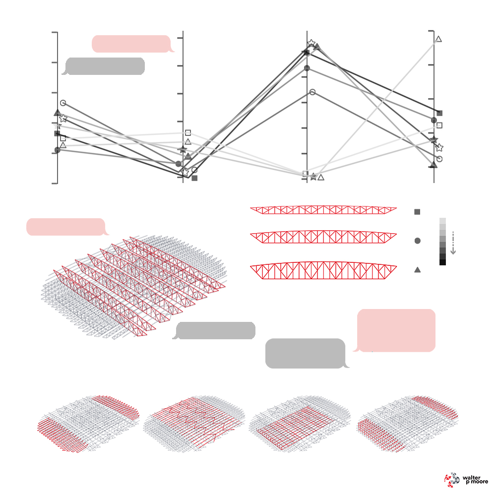
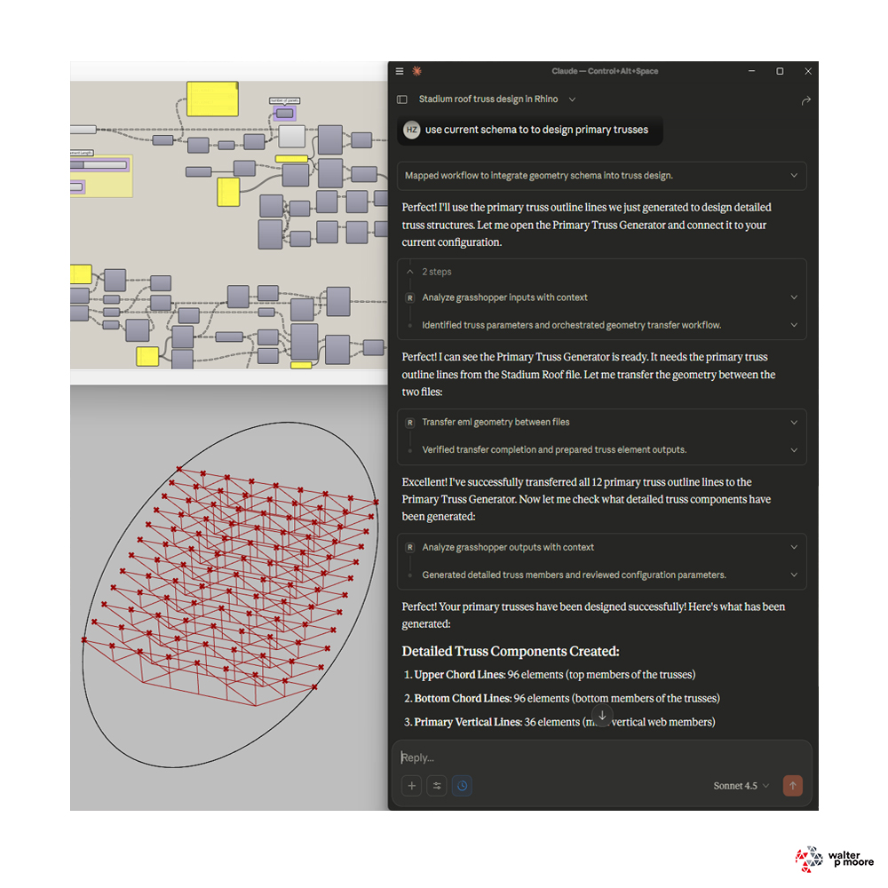
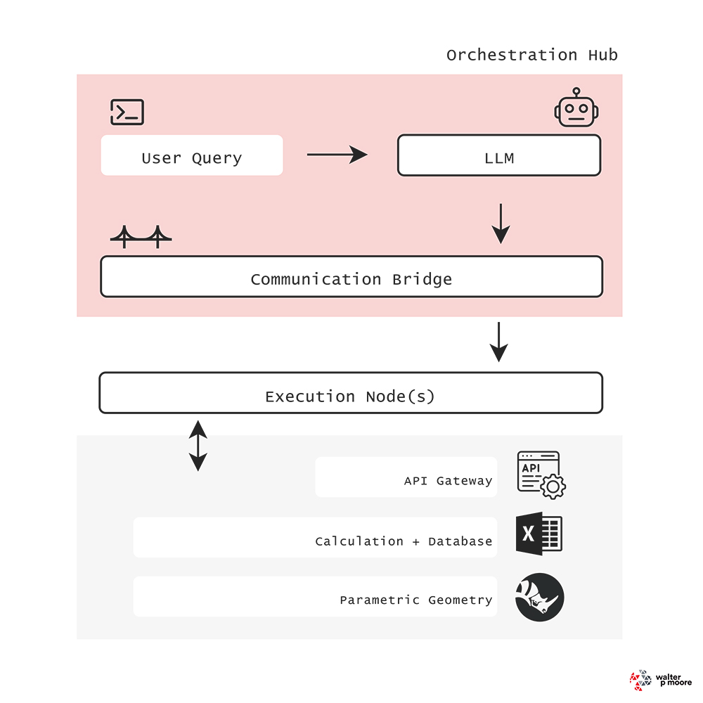

<div align="center">
  
</div>

# Workshop 1: Agentic AI Design Orchestration using MCP

**AAG2025: Advances in Architectural Geometry - Massachusetts Institute of Technology** | 
**16—17 November 2025** | 
[Workshop Page](https://www.aag2025.com/workshop-1)

<div align="center">
  
  
  
</div>


# Rhino Grasshopper MCP Server

A Model Context Protocol (MCP) server providing 30+ tools for interacting with Rhino 3D and Grasshopper through natural language. Features include parametric geometry generation, cross-file workflows, intelligent geometry transfer, and automated workflow suggestions. Uses an HTTP bridge architecture to handle Python version compatibility between MCP (Python 3.10+) and Rhino's IronPython.

## Architecture

```
┌─────────────────┐         ┌──────────────────┐         ┌─────────────┐
│   MCP Client    │ ◄─────► │   MCP Server     │ ◄─────► │   Rhino     │
│                 │   MCP   │ (Python 3.10+)   │  HTTP   │   Bridge    │
└─────────────────┘         └──────────────────┘         └─────────────┘
                                                              ▲
                                                              │
                                                         Rhino API
                                                         Grasshopper API
```

## Key Features

- **30+ Tools** - Comprehensive toolset for Rhino 3D and Grasshopper automation
- **Smart Geometry Transfer** - Automatically converts and validates geometry between files (Lines, Curves, Surfaces, Meshes, Breps)
- **EML Convention** - Automated parameter discovery using `eml_` prefix for cross-file workflows
- **Workflow Suggestions** - JSON metadata system suggests file sequences and parameter connections
- **File Management** - Auto-launching Grasshopper, batch file operations, file verification
- **DEBUG_MODE** - Toggle verbose output via `.env` file for 60-80% token savings in production
- **Custom Scripts** - Execute Python code in Grasshopper with full access to component data
- **Geometry Baking** - User-controlled baking to Rhino with layer management and confirmation
- **Auto-Discovery** - Decorator-based tool registration - no manual configuration needed

## Project Structure

### MCP/
MCP server and client integration:
- `main.py` - MCP server with auto-discovery
- `bridge_client.py` - HTTP client for Rhino communication
- `config/` - Configuration templates
- `requirements.txt` - Python 3.10+ dependencies

### Rhino/
HTTP bridge server running inside Rhino:
- `rhino_bridge_server.py` - HTTP server (IronPython 2.7/3.9)
- `start_rhino_bridge.py` - Startup script

### Tools/
Tool definitions with decorator-based auto-discovery:
- `rhino_tools.py` - Rhino 3D tools
- `gh_tools.py` - Grasshopper tools
- `tool_registry.py` - Auto-discovery system
- `Grasshopper File Library/` - .gh file storage

## Quick Start

### 1. Install MCP Server Dependencies
```bash
cd MCP/
pip install -r requirements.txt
```

### 2. Start Rhino Bridge Server
1. Open Rhino 8
2. Open Python Script Editor: `Tools > Script > Edit`
3. Load and run:
   ```python
   exec(open(r'C:\path\to\rhino_gh_mcp\Rhino\start_rhino_bridge.py').read())
   ```
4. Verify: Visit `http://localhost:8080/status`

### 3. Configure MCP Client
Add to your MCP client configuration file (optional: if running in a virtual environment, you can point you command to that python executable):

```json
{
  "mcpServers": {
    "rhino_gh": {
      "command": "python",
      "args": ["C:\\path\\to\\rhino_gh_mcp\\MCP\\main.py"]
    }
  }
}
```

### 4. Restart MCP Client
Restart your MCP client to load the server.

## Configuration

### DEBUG_MODE (Optional)

Control tool response verbosity to optimize token usage:

1. Copy `.env.example` to `.env` in project root
2. Set `DEBUG_MODE=true` for development or `DEBUG_MODE=false` for production
3. Restart Rhino bridge server to apply changes

**Benefits:**
- `DEBUG_MODE=false` - Saves 60-80% tokens by removing verbose debug logs (recommended for production)
- `DEBUG_MODE=true` - Full diagnostic output for troubleshooting

See `Tools/README.md` for detailed examples.

### Workflow Metadata (Optional)

Add JSON metadata to describe Grasshopper files and enable workflow suggestions:

1. Create `metadata.json` in `Tools/Grasshopper File Library/`
2. Define file inputs, outputs, dependencies, and workflows
3. Use `suggest_grasshopper_workflow` tool for intelligent file sequence suggestions

Example metadata structure available in `Tools/Grasshopper File Library/metadata.json`.

## Available Tools

### Rhino Tools (5)
- `draw_line_rhino` - Draw lines in 3D space
- `get_rhino_info` - Get session information
- `typical_roof_truss_generator` - Generate parametric trusses
- `get_selected_rhino_objects` - Get selected object data
- `get_rhino_object_geometry` - Extract geometry

### Grasshopper File Management (5)
- `list_gh_files` - List available .gh files
- `open_gh_file` - Open file (auto-launches Grasshopper)
- `open_all_gh_files` - Open all files at once
- `get_active_gh_files` - Get currently open files
- `close_gh_file` - Close specific file

### EML Parameter Tools (4)
Convention-based tools using `eml_` prefix for automated workflows:
- `list_eml_parameters` - Discover eml_ prefixed components
- `get_eml_parameter_value` - Extract parameter values
- `set_eml_parameter_value` - Set parameter values
- `suggest_eml_connections` - Suggest data flow connections

### Cross-File Workflow Tools (2)
- `transfer_eml_geometry_between_files` - Direct geometry transfer
- `execute_eml_workflow` - Multi-file workflow orchestration

### Traditional Grasshopper Tools (16)
- `list_grasshopper_sliders` / `set_grasshopper_slider`
- `set_multiple_grasshopper_sliders`
- `analyze_grasshopper_sliders`
- `analyze_grasshopper_inputs_with_context`
- `analyze_grasshopper_outputs_with_context`
- `get_grasshopper_overview`
- `get_grasshopper_components`
- `list_grasshopper_valuelist_components`
- `set_grasshopper_valuelist_selection`
- `list_grasshopper_panels` / `set_grasshopper_panel_text`
- `get_grasshopper_panel_data`
- `set_grasshopper_geometry_input`
- `extract_grasshopper_geometry_output`
- `debug_grasshopper_state`

### Advanced Tools (5)
- `bake_grasshopper_geometry` - Bake geometry to Rhino with layer control
- `execute_custom_grasshopper_script` - Run Python in GH context
- `suggest_grasshopper_workflow` - Get workflow suggestions from metadata
- `set_active_gh_file` - Switch active document
- `predict_truss_tonnage` - Predict long span truss tonnage based on polynomial regression model from sample data

## Using Grasshopper Files

**IMPORTANT:** Before using Grasshopper files with the MCP tools, ensure they are properly configured:

### Prerequisites for Grasshopper Files:

1. **Test files manually first** - Open each .gh file directly in Grasshopper to verify it loads without errors
2. **Install required plugins** - Ensure all plugin dependencies are installed in Rhino/Grasshopper
3. **Check file references** - Verify any external file references or linked resources are accessible
4. **Save files properly** - Ensure files are saved in a stable state without errors

### Common Issues:

- **Files fail to open via MCP** - Usually indicates missing plugins or file errors. Open manually in Grasshopper to see specific error messages.
- **Timeout errors** - File may be too large or have circular references causing slow solutions. Simplify or disable heavy components.

**Only after verifying files work correctly in Grasshopper should you use them with MCP tools for automation.**

Store verified .gh files in `Tools/Grasshopper File Library/` for use with file management tools.

## EML Convention

The `eml_` (External ML) prefix enables automated component discovery in Grasshopper:

**Supported Components:**
| Type | Example | Purpose |
|------|---------|---------|
| Number Slider | `eml_panel_count` | Numeric inputs |
| Panel | `eml_output_data` | Text display |
| Boolean Toggle | `eml_enable_feature` | On/off switches |
| Value List | `eml_material_type` | Dropdowns |
| Geometry Parameter | `eml_input_curve` | Geometry I/O |

**Workflow Example:**
```
1. Open generator.gh with eml_output_curve
2. Extract geometry using list_eml_parameters
3. Open processor.gh with eml_input_curve
4. Transfer using transfer_eml_geometry_between_files
```

This enables cross-file automation without manual rewiring.

## Adding New Tools

Tools use decorator-based auto-discovery. Add both decorators to the same file:

```python
# MCP tool (client-side)
@rhino_tool(name="create_circle", description="Create a circle...")
async def create_circle(center_x: float, center_y: float, radius: float):
    return call_bridge_api("/create_circle", {
        "center_x": center_x,
        "center_y": center_y,
        "radius": radius
    })

# Bridge handler (server-side)
@bridge_handler("/create_circle")
def handle_create_circle(data):
    import rhinoscriptsyntax as rs
    center = [data['center_x'], data['center_y'], 0]
    radius = data['radius']
    circle_id = rs.AddCircle(center, radius)
    return {"success": True, "circle_id": str(circle_id)}
```

Restart both servers to activate new tools.

## Troubleshooting

**Bridge server not responding:**
- Check Rhino is open and bridge script is running
- Visit `http://localhost:8080/status` to verify
- Check port 8080 isn't blocked by firewall

**Tools not appearing:**
- Verify MCP client config path is correct
- Restart MCP client after config changes
- Check `MCP/main.py` path uses absolute path

**Grasshopper tools failing:**
- Ensure Grasshopper plugin is loaded in Rhino
- Restart bridge server after code changes
- Check Rhino Python console for errors

**Type errors in bridge:**
- IronPython doesn't support all type hints
- Use simple types or omit type hints in bridge handlers

## Testing

1. **Bridge Status:** `curl http://localhost:8080/status`
2. **List Endpoints:** `curl http://localhost:8080/info`
3. **Test Tool:** Use MCP client to execute tools
4. **Debug:** Check Rhino Python console for bridge errors

## Requirements

- Rhino 8 with Python support
- Python 3.10+ for MCP server
- Grasshopper (optional, for parametric tools)
- MCP-compatible client

## License

MIT License

## Author

Hossein Zargar (Seyed Hossein Zargar)
